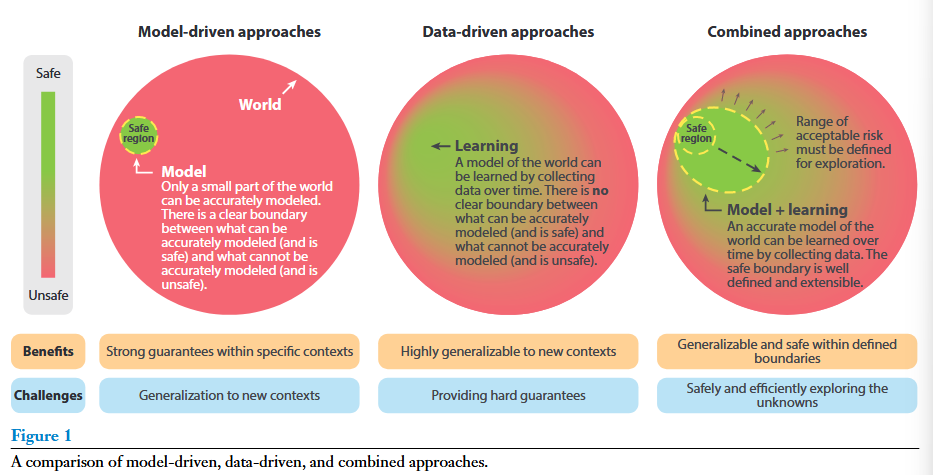
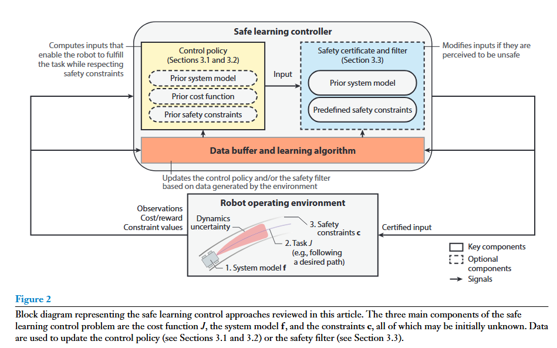
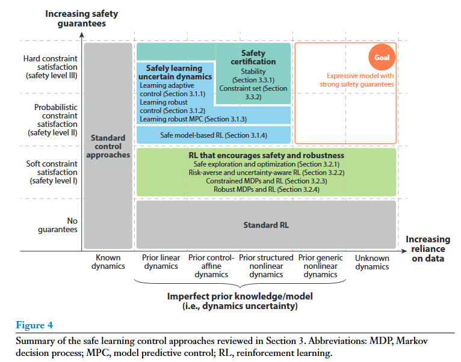
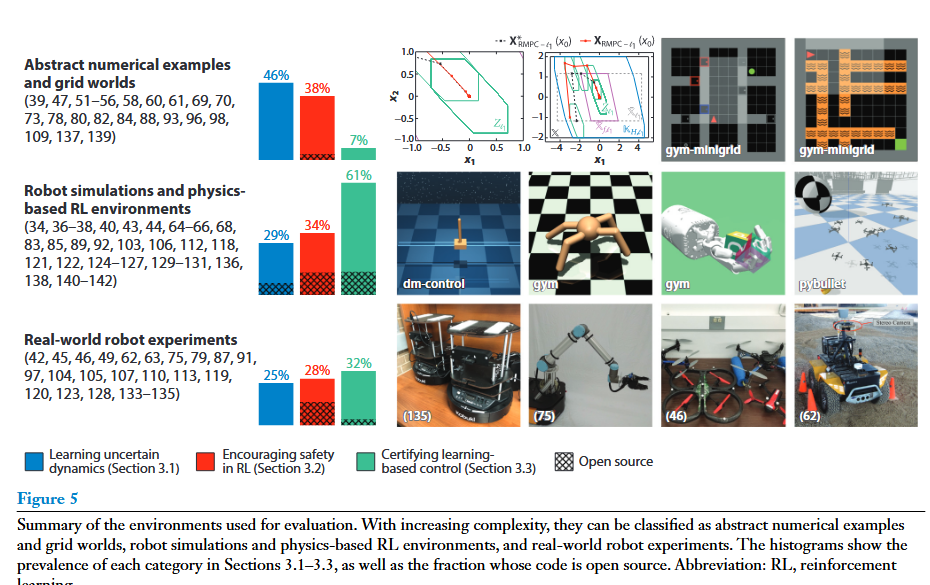
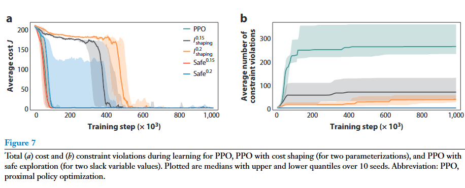
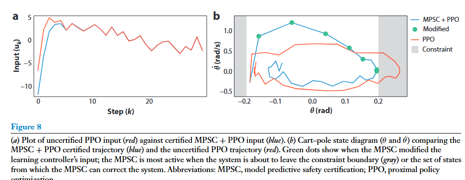

# Notes

## Def of Safe Learning

*   不仅仅关注收敛后的性能，而是保证学习的每一步都安全

### Safety level

*   3: constraint satisfaction guaranteed
*   2: constraint satisfaction with high probability
*   1: constraint satisfaction encouraged

## Control theory perspective

*   模型预测控制（MPC）
*   控制屏障函数（CBFs）
*   robust MPC
*   constrain exploration

## RL Perspective

*   constrained RL
*   reward shaping
*   risk sensitive RL
*   safe exploration

## Combination

### Approaches that address the problem of safe learning control at two stages:

1.  online adaptation or learning

    1.  online data are used to adjust paras of the controller, the robot dynamic model, cost function, constrain functions, …

2.  offline learning

    1.  recorded collected data and use to update model

## Safe learning control approaches

*   learning uncertain dynamics to safe improve performance

    *   integrating machine and adaptive control
    *   learning-base robust control
    *   reducing conservatism in robust model predictive control with learning and adaption
    *   safe model-based reinforcement learning with a priori dynamics

*   encouraging safety and robustness in RL

    *   safe exploration and optimization
    *   risk-averse reinforcement learning and uncertainty-aware reinforcement learning
    *   constrained Markov decision processes and reinforcement learning
    *   robust Markov decision processed and reinforcement learning

*   certifying learning-based control under dynamics uncertainty

    *   stability certification
    *   constraint set certification

## 4.BENCHMARKS

### 1. **安全层 / Safety Filter（动作修正）**

*   机器人RL策略输出一个动作  $u_{RL}$ 。

*   在执行前，**安全层会检查是否满足约束**（比如关节力矩不超限、姿态不失稳）。

*   如果不安全，就替换为最接近的安全动作  $u_{safe}$ 。

*   实现方式：

    *   **CBF（控制屏障函数）**：实时解优化问题，强制状态保持在安全集内。

    *   **QP（Quadratic Programming）安全投影**：解  $\min ||u - u_{RL}||^2$  约束在安全范围。

***

### 2. **安全探索 / Safe Exploration**

*   RL 训练时不是盲目尝试，而是**限制动作空间**：

    *   初期在一个已知的**安全集**里探索（比如慢走、低速转向）。
    *   随着数据积累，逐渐扩大安全集。

*   常见方法：

    *   **基于高斯过程（GP）的SafeOpt**：只在模型置信区间内探索。
    *   **Lyapunov-based RL**：策略更新时强制保证Lyapunov稳定条件。

***

### 3. **结合控制理论的 RL 更新**

*   用 **MPC + RL** 或 **RL + 控制律**：

    *   RL 学习高层策略（如步态参数），底层由MPC或PD控制保证稳定。
    *   RL 更新基于真机数据，但安全性由底层控制保证。

*   或者在 RL 更新时引入 **约束 MDP（CMDP）**：

    *   在优化时同时考虑奖励和安全约束。
    *   如果新策略可能违反约束 → 不更新或退回上个安全策略。

***

## 实时数据更新流程（实践）

在机器人真机上常见的安全 RL loop 大概长这样：

1.  **传感器采集数据**
2.  **策略产生动作**。
3.  **安全层检查/修正动作**（CBF/QP/MPC）
4.  **执行动作并收集数据**（state, reward, constraint violation）
5.  **后台异步更新RL参数**
6.  **安全验证**：新参数只在验证通过后才上线执行

## 可能的实现方法：

1.  PPO/SAC + **动作安全层**（QP投影/CBF）
2.  RL只学步态参数，高频稳定性由MPC或LQR控制保证。
